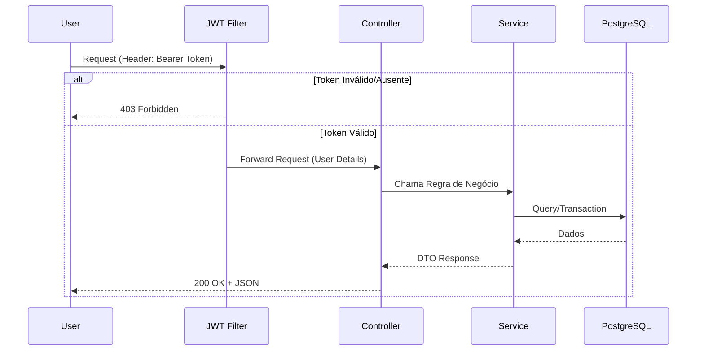
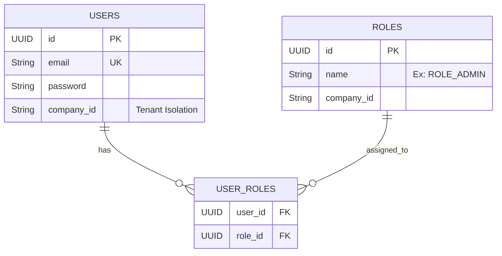

# 🔐 Enterprise IAM Service (Identity & Access Management)


> Um microsserviço de autenticação e autorização robusto, projetado para ambientes corporativos SaaS, implementando padrões modernos de segurança, RBAC e escalabilidade.

---

## 🏗️ Arquitetura da Solução

O projeto segue uma **Arquitetura em Camadas (Layered Architecture)** estrita para garantir a separação de responsabilidades e testabilidade.

### Fluxo de Autenticação (JWT)
O diagrama abaixo ilustra como o sistema processa uma requisição segura.



---

## 💾 Modelagem de Dados (ER Diagram)

O sistema foi preparado para **Multi-tenancy** (várias empresas usando a mesma base), onde cada registro crítico possui um `company_id`.



---

## 🚀 Decisões Técnicas e Padrões de Projeto

Para garantir um código nível Enterprise, foram aplicados os seguintes conceitos:

| Conceito / Padrão | Onde foi aplicado? | Por que usar? |
| :--- | :--- | :--- |
| **DTO Pattern** | `AuthenticationRequest`, `RegisterRequest` | Evita expor as Entidades JPA diretamente na API, prevenindo vazamento de dados sensíveis (senha). |
| **Repository Pattern** | `UserRepository` | Abstrai a camada de acesso a dados, facilitando a troca de banco ou testes (Mock). |
| **Builder Pattern** | Lombok `@Builder` | Criação de objetos complexos (User, Role) de forma fluente e imutável. |
| **Strategy/Adapter** | `UserDetailsServiceImpl` | Adapta nossa entidade `User` para o contrato `UserDetails` que o Spring Security exige. |
| **Global Exception Handling** | `@RestControllerAdvice` | Centraliza o tratamento de erros, garantindo que o cliente sempre receba um JSON limpo, nunca um StackTrace. |

---

## 🛡️ Funcionalidades de Segurança

1.  **Stateless Authentication:** Uso de **JWT (JSON Web Tokens)** assinados com HMAC-SHA256. Nenhuma sessão é salva no servidor (escalabilidade horizontal).
2.  **Password Hashing:** Senhas criptografadas com **BCrypt** (custo 10) antes de ir para o banco.
3.  **RBAC (Role-Based Access Control):**
    *   `ROLE_USER`: Acesso básico.
    *   `ROLE_ADMIN`: Acesso privilegiado (endpoints bloqueados via `@PreAuthorize`).
4.  **Input Validation:** Validação rigorosa com **Bean Validation** (Jakarta) para impedir SQL Injection e dados sujos.

---

## 📦 Como Rodar o Projeto

### Pré-requisitos
*   Docker & Docker Compose
*   Java 17+ (Opcional se usar Docker)
*   Maven

### Passo a Passo

1.  **Clone o repositório:**
    ```bash
    git clone https://github.com/SEU_USUARIO/enterprise-iam-service.git
    ```

2.  **Inicie a Infraestrutura (Postgres + Redis):**
    ```bash
    docker-compose up -d
    ```

3.  **Execute a Aplicação:**
    ```bash
    ./mvnw spring-boot:run
    ```

4.  **Acesse a Documentação Interativa (Swagger):**
    *   URL: `http://localhost:8080/swagger-ui/index.html`

---

## 🧪 Testes

O projeto conta com testes unitários cobrindo os serviços críticos usando **JUnit 5** e **Mockito**.

Para rodar os testes:
```bash
./mvnw test
```

---

## 👨‍💻 Autor

Desenvolvido por **Murylo Marques**. Focado em Arquitetura de Software e Java Enterprise.

[](https://linkedin.com/in/SEU_LINKEDIN_AQUI)