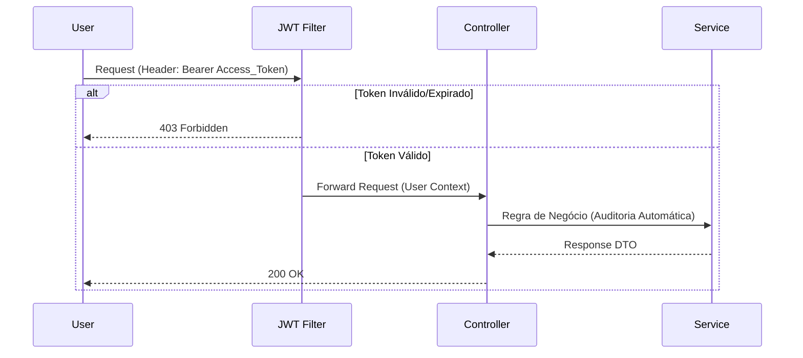
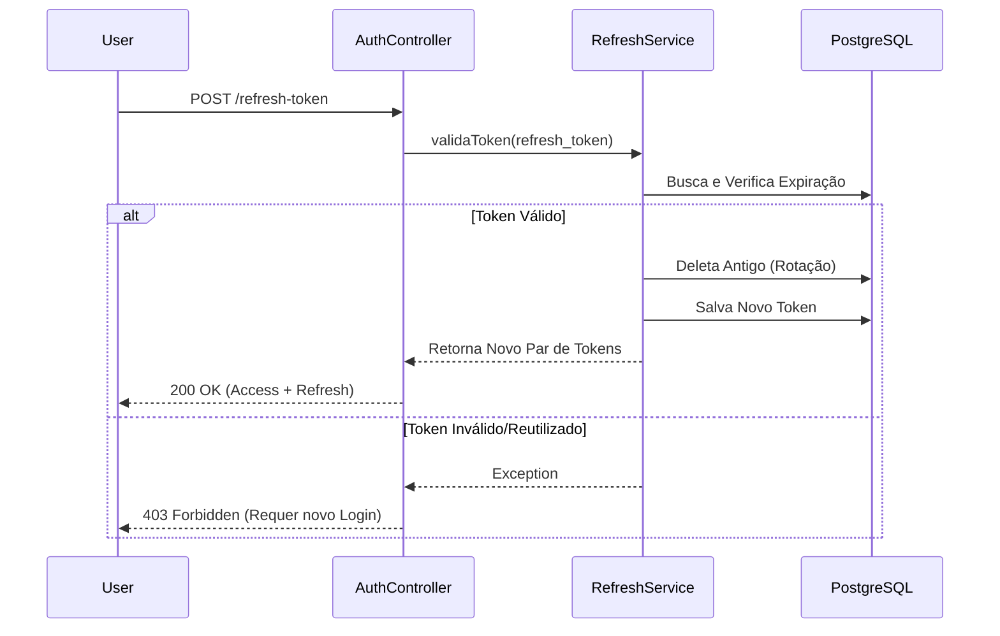
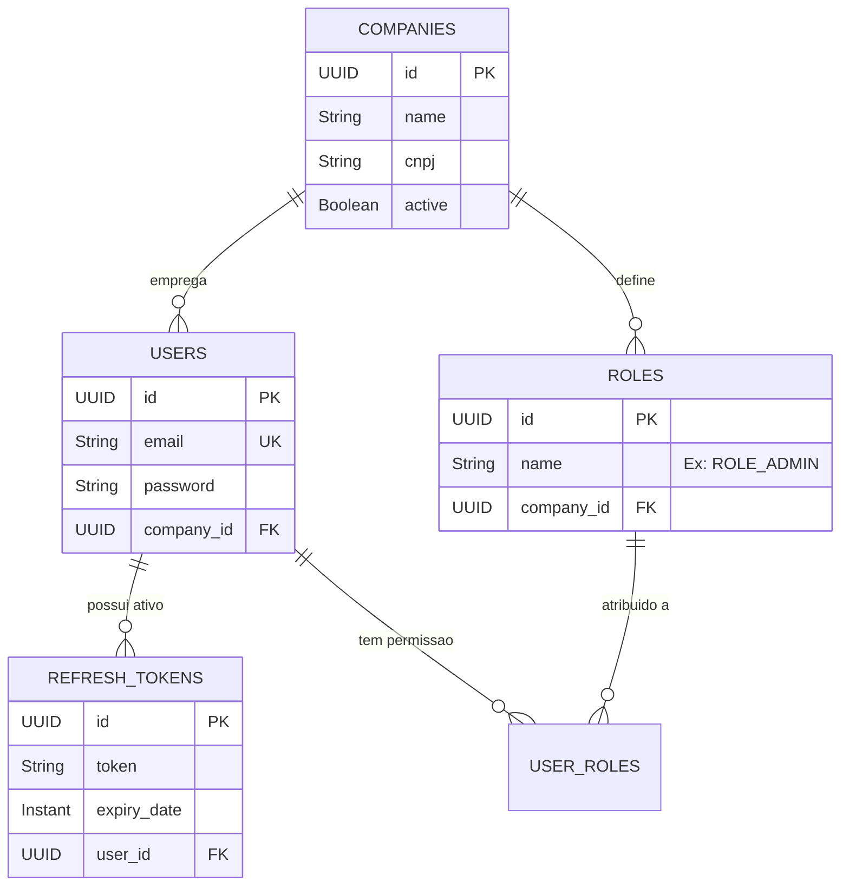

# 🛡️ Enterprise IAM Service (Identity & Access Management)


> Um microsserviço de autenticação e autorização robusto, projetado para ambientes corporativos SaaS, implementando padrões modernos de segurança, RBAC, Multi-tenancy real e Rotação de Tokens.

---

## 🏗️ Arquitetura e Fluxos de Segurança

O projeto segue uma **Arquitetura em Camadas** estrita. Abaixo, detalho os dois fluxos principais de autenticação.

### 1. Fluxo de Autenticação (Login & Access)
O acesso aos recursos protegidos é feito via **JWT Stateless**.



### 2. Fluxo de Token Rotation (Refresh Token)
Para aumentar a segurança, o Access Token tem vida curta. O Refresh Token (salvo no banco) permite renovação sem login, com **rotação automática** (uso único) para prevenir roubo de sessão.



---

## 💾 Modelagem de Dados (ER Diagram)

O sistema implementa **Multi-tenancy Relacional**. Usuários e Permissões (Roles) pertencem estritamente a uma Empresa (`COMPANIES`).



---

## 🚀 Funcionalidades Enterprise

Diferenciais técnicos implementados além do básico:

| Funcionalidade | Implementação Técnica | Benefício |
| :--- | :--- | :--- |
| **Secure Token Rotation** | `RefreshTokenService` | Se um token for roubado, ele vale por pouco tempo. O refresh token é invalidado após o uso. |
| **Multi-tenancy Real** | Entidade `Company` + Relationships | Isolamento lógico de dados. Um usuário da "Google" não acessa dados da "Microsoft". |
| **Auditoria Automática** | `@EntityListeners(AuditingEntityListener.class)` | Rastreio automático de `created_at` e `updated_at` sem sujar o código de negócio. |
| **Tratamento de Erros** | `@RestControllerAdvice` | Padronização de respostas de erro (401, 403, 404) em formato JSON amigável. |
| **RBAC Dinâmico** | `@PreAuthorize("hasRole('ADMIN')")` | Proteção granular de endpoints baseada em cargos. |

---

## 📦 Como Rodar o Projeto

### Pré-requisitos
*   Docker & Docker Compose
*   Java 17+ (Opcional se usar Docker)
*   Maven

### Passo a Passo

1.  **Clone o repositório:**
    ```bash
    git clone https://github.com/murylomarques/enterprise-iam-service.git
    ```

2.  **Inicie a Infraestrutura (Postgres + Redis):**
    ```bash
    docker-compose up -d
    ```

3.  **Execute a Aplicação:**
    ```bash
    ./mvnw spring-boot:run
    ```

4.  **Acesse a Documentação Interativa (Swagger):**
    *   URL: `http://localhost:8080/swagger-ui/index.html`

---

## 🧪 Testando a API (Exemplos)

### 1. Criar Empresa e Usuário (Registro)
O sistema detecta se a empresa existe. Se não, cria uma nova (Tenant onboarding).
**POST** `/auth/register`
```json
{
  "firstName": "Murylo",
  "lastName": "CEO",
  "email": "ceo@tech.com",
  "password": "123",
  "companyId": "Minha Startup SaaS"
}
```

### 2. Renovação de Acesso (Refresh Token)
**POST** `/auth/refresh-token`
```json
{
  "refreshToken": "COLE_SEU_UUID_AQUI"
}
```

---

## 👨‍💻 Autor

Desenvolvido por **Murylo Marques**. Focado em Arquitetura de Software e Java Enterprise.

[](https://www.linkedin.com/in/murylo-marques)